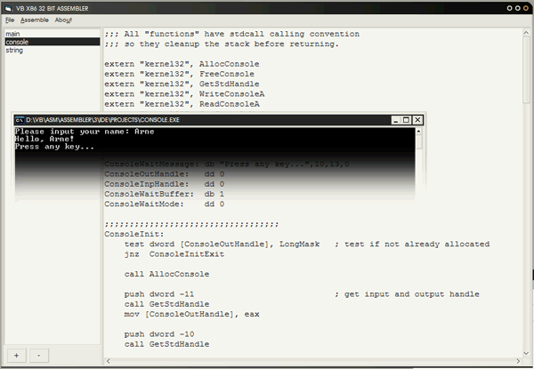



## X86 32 Bit Assembler

### Description

This is an experimental 32 Bit Assembler. Originally planned for me to learn assembly language it turned out way bigger then I thought. It supports most of the standard, FPU, MMX, SSE and 3DNow instructions,

can write Windows executables, has WinAPI support, can assemble SIB expressions (for example [eax*2+ebx-10]) and of course has labels. There are 2 examples in the zip file: An editor for writing Windows Executables and an example of assembling source code at runtime to directly call it (a touch of inline assembler).

//Update: The examples had German comments and there was a small bug in the console example.
 
### More Info
 

             |
---                |---
**Submitted On**   |2008-01-02 15:43:36
**By**             |[Arne Elster](https://github.com/Planet-Source-Code/PSCIndex/blob/master/ByAuthor/arne-elster.md)
**Level**          |Advanced
**User Rating**    |5.0 (145 globes from 29 users)
**Compatibility**  |VB 6\.0
**Category**       |[Complete Applications](https://github.com/Planet-Source-Code/PSCIndex/blob/master/ByCategory/complete-applications__1-27.md)
**World**          |[Visual Basic](https://github.com/Planet-Source-Code/PSCIndex/blob/master/ByWorld/visual-basic.md)
**Archive File**   |[X86\_32\_Bit209604122008\.zip](https://github.com/Planet-Source-Code/arne-elster-x86-32-bit-assembler__1-69861/archive/master.zip)

